# AirComp — Over-the-Air Computation Simulation Framework

A modular Python framework for simulating **analog over-the-air computation
(AirComp)** in an **indoor** wireless environment, where a *small* number of
**hosts** (access points / parameter servers) aggregate signals transmitted
concurrently by a *large* number of **agents** (edge devices / sensors). Both
hosts and agents can be single- or multi-antenna (fully configurable).

AirComp exploits the signal-superposition property of the wireless
multiple-access channel: when all agents transmit at once, the host receives the
channel-weighted **sum** of their signals. With appropriate pre-/post-processing
this realises a *nomographic* function

```
f(s_1, …, s_K) = ψ( Σ_k φ_k(s_k) )
```

such as the arithmetic mean (the canonical aggregation step in federated
learning), a weighted sum, or the geometric mean — in a **single channel use**,
regardless of the number of agents `K`.

## Why this regime

In realistic indoor deployments there are far more devices than access points
(`n_hosts ≪ n_agents`). The framework models this directly: each host carries an
antenna array, and a central processor performs **joint aggregation beamforming**
across all cooperating hosts (a cell-free-style setup), so the few hosts still
provide enough receive dimensions to serve many agents.

## Signal model (MIMO)

Antenna counts on **both** ends are configurable: agents have `N_t` transmit
antennas and hosts have `N_r` receive antennas each (either can be 1). `K` agents
transmit standardised symbols `x` (with `E|x_k|² = 1`) through transmit
beamforming vectors `b_k ∈ ℂ^{N_t}` with power budget `‖b_k‖² ≤ P_k`. With the
stacked MIMO channel `H ∈ ℂ^{R×K×N_t}` (`R = n_hosts × N_r`), the received signal is

```
y = Σ_k H_k b_k x_k + n,        n ~ CN(0, σ² I)
```

The host applies an aggregation combiner `m ∈ ℂ^R` and a denoising factor `η` to
estimate the target sum `T = Σ_k x_k`:

```
T̂ = (mᴴ y) / √η
```

For a fixed `m`, the effective per-agent channel is `f_k = H_kᴴ m ∈ ℂ^{N_t}`. Each
agent uses **maximum-ratio transmission** `b_k = √η · f_k / ‖f_k‖²` to hit the
target gain with least power, so **channel-inversion power control** gives

```
η = min_k P_k ‖H_kᴴ m‖²           (the worst agent limits the whole computation)
MSE = ‖m‖² σ² / η
```

For single-antenna agents (`N_t = 1`) this reduces exactly to the scalar case
`‖H_kᴴ m‖² = |mᴴ h_k|²`; for single-antenna hosts (`R = 1`) the combiner is a
scalar and MRC coincides with the optimised design.

### Channel model (`aircomp/channel.py`)

Each host–agent link is a matrix `H_k = √β · H_small`:

* **Large-scale gain `β`** — log-distance path loss with a free-space intercept,
  configurable path-loss exponent (indoor ≈ 1.6–3.5), plus log-normal shadowing.
* **Small-scale `H_small`** — Rician fading (configurable `K`-factor) whose LoS
  part is the rank-one outer product `a_rx a_txᴴ` of **geometry-derived steering
  vectors** for the host and agent ULAs, plus an i.i.d. Rayleigh NLoS matrix.
* **Noise** — thermal `kTB` over the configured bandwidth and receiver noise figure.

### Receivers (`aircomp/aggregation.py`)

| Aggregator | Combiner design |
|---|---|
| `ChannelInversionAggregator("mrc")` | Maximum-ratio combining, `m = Σ_{k,t} H[:,k,t]` (baseline) |
| `ChannelInversionAggregator(m)` | Any user-supplied fixed combiner |
| `OptimizedBeamformingAggregator` | Maximises the worst-agent gain `min_k ‖H_kᴴm‖²/‖m‖²` via Riemannian (unit-sphere) gradient ascent on a smooth soft-min surrogate — directly minimising the channel-inversion MSE |

Both aggregators assume MRT transmit beamforming at multi-antenna agents; the
transmit and receive designs together form the alternating-optimal joint scheme.

## Supported operations

Every operation reduces to the AirComp sum primitive `ψ(Σ_k φ_k(s_k))`; see
[functions.py](aircomp/functions.py).

| Family | Operation | φ_k (pre) / ψ (post) |
|---|---|---|
| **Natural-medium** | Addition | Σ s_k (identity) |
| | Subtraction | Σ ε_k s_k, `ε_k ∈ {±1}` |
| **Nomographic** | Arithmetic mean | ψ = ·/K |
| | Weighted average | φ = w_k s_k, ψ = ·/Σw_k |
| | Geometric mean | φ = ln s_k, ψ = exp(·/K) |
| | Euclidean norm | φ = s_k², ψ = √· |
| | Polynomial sum | φ = p(s_k) |
| **Advanced / approx.** | Majority vote | φ = 2v_k−1, ψ = sign |
| | Counting | φ = 1[s_k>τ], ψ = round |
| | Histogram | φ = one-hot(bin), ψ = round (D sums) |
| | Maximum | φ = s_k^p, ψ = ·^{1/p} |
| | Minimum | φ = s_k^{−p}, ψ = ·^{−1/p} |

### Principle and what each operation depends on

AirComp is **analog**: every agent standardises its pre-processed value `φ_k(s_k)`
to unit power, a DAC turns it into a baseband symbol, transmit precoding +
channel-inversion power control align the contributions, and the host's antennas
superimpose them into `Σ_k φ_k(s_k)` — which an ADC samples and `ψ` turns into the
result. Three things therefore set the accuracy of *every* operation:

* **Channel condition** — the denoising factor `η = min_k P_k‖H_kᴴm‖²` is fixed by
  the *worst* agent's effective gain, and the computation error is `MSE = ‖m‖²σ²/η`.
  A deep fade or heavy shadowing on any single agent (a "straggler") throttles the
  whole computation, so accuracy tracks the tail of the channel distribution, not
  the average.
* **Antennas** — more **host** antennas give receive-beamforming gain and let `m`
  steer to lift the worst agent (raising `η`); more **agent** antennas give
  transmit (MRT) array gain. Both raise the computation SNR and lower NMSE.
* **DAC / ADC (amplitude *and* sampling resolution)** — two orthogonal converter
  limits. *Amplitude*: finite bits plus clipping set a quantisation floor, and
  pre-processing that spreads the `φ_k` over a wide dynamic range raises PAPR and
  eats converter headroom. *Sampling*: oversampling (samples per symbol) spreads
  quantisation noise over a wider band, so matched-filtering back to one symbol
  recovers ~`10·log10(OSR)` dB of it — trading sample rate for effective bits.

#### Tuning options

All three dependencies are directly tunable from `SystemConfig`.

**Channel condition** — raise the operating SNR or ease the propagation:

| Knob | Field | Effect |
|---|---|---|
| Transmit power | `SystemConfig.tx_power_dbm` | +1 dBm ≈ −1 dB NMSE (until converter/approx-limited) |
| Path-loss exponent | `channel.path_loss_exponent` | lower (≈1.8) → stronger links; raise for harsher indoor |
| Shadowing spread | `channel.shadowing_std_db` | smaller → fewer deep-fade stragglers → lower NMSE |
| LoS strength | `channel.rician_k_db` | higher K → stronger LoS, so steering/beamforming bites harder |
| Noise | `channel.bandwidth_hz`, `channel.noise_figure_db` | narrower band / lower NF → lower noise power `σ²` |
| Receiver | `aggregator` | `OptimizedBeamformingAggregator` raises the worst-agent gain vs. MRC |
| Geometry | `room.*`, `n_hosts` placement | smaller room / more hosts → shorter links |

**Antennas** — add receive/transmit dimensions:

| Knob | Field | Effect |
|---|---|---|
| Host antennas | `SystemConfig.host_antennas` | receive-beamforming + diversity gain (monotonic) |
| Number of hosts | `SystemConfig.n_hosts` | more joint receive dimensions (cell-free aggregation) |
| Agent antennas | `SystemConfig.agent_antennas` | transmit-MRT array gain (≈ +3 dB per doubling) |
| Array spacing | `SystemConfig.array_spacing_wavelengths` | wider spacing → less correlated fading |
| Solver effort | `OptimizedBeamformingAggregator(n_iter, step_size, smoothing)` | more iterations → closer to the max-min optimum |

**DAC / ADC** — now modelled via `SystemConfig.converters` (`ConverterConfig`,
ideal by default). Quantisation costs roughly **6 dB NMSE per bit**:

| Knob | Field | Effect |
|---|---|---|
| DAC amplitude resolution | `converters.dac_bits` | `None` = ideal; finite bits add transmit quantisation (~6 dB/bit) |
| ADC amplitude resolution | `converters.adc_bits` | `None` = ideal; finite bits add receive quantisation (~6 dB/bit) |
| DAC headroom | `converters.dac_clip_sigma` | full-scale peak / RMS; small → clips peaks, large → wastes levels |
| ADC headroom | `converters.adc_clip_sigma` | same trade-off at the receiver AGC |
| DAC sampling resolution | `converters.dac_oversampling` | OSR (samples/symbol); +~3 dB per doubling (~0.5 bit/octave) |
| ADC sampling resolution | `converters.adc_oversampling` | OSR at the receiver; same processing gain |

Amplitude bits and oversampling combine: e.g. a 6-bit ADC at `OSR = 16` recovers
about `10·log10(16) ≈ 12 dB`, roughly a 8-bit converter at Nyquist.

```python
from aircomp import SystemConfig, ConverterConfig
cfg = SystemConfig(host_antennas=16, agent_antennas=4, tx_power_dbm=25,
                   converters=ConverterConfig(dac_bits=10, adc_bits=10,
                                              dac_oversampling=4, adc_oversampling=4))
```

Per-operation principle and sensitivities:

* **Addition** — the medium sums the transmitted amplitudes directly; accuracy is
  the raw computation SNR. Balanced dynamic range, so easy on the DAC/ADC.
* **Subtraction** — identical to addition with a `±1` sign folded into each symbol;
  same channel/antenna/converter behaviour.
* **Arithmetic mean** — sum then scale by `1/K`; the `1/K` also shrinks the noise,
  so the mean is *more* robust than the raw sum as the agent count grows.
* **Weighted average** — agents pre-scale by `w_k`; a wide weight spread widens the
  DAC dynamic range and makes the low-weight agents' channels matter less.
* **Geometric mean** — sum in the log domain, then `exp`; the log **compresses**
  dynamic range, making this the most converter- and noise-friendly operation
  (best NMSE in the benchmark), but it needs strictly positive data.
* **Euclidean norm** — square, sum, `√`; squaring widens dynamic range (the largest
  agents dominate), while the final `√` compresses the residual error.
* **Polynomial sum** — each agent evaluates the polynomial locally, then sums;
  high-degree terms expand the dynamic range (DAC/ADC headroom) and amplify each
  agent's noise sensitivity.
* **Majority vote** — sum of `±1` votes, decided by sign; robust to noise except
  near a tie (small `|Σ|`), where a fade can flip the outcome. Accuracy is set by
  the vote margin relative to the computation SNR, not by raw NMSE — hence the
  exact-match rate is the meaningful metric.
* **Counting** — sum of indicators, then round; the integer count is recovered
  *exactly* whenever the SNR keeps the sum error below ½, so more antennas / power
  push it to 100% exact.
* **Histogram** — one counting sum per bin, so it costs `D` channel uses (sharing
  the same beamformer); low-count bins are the most noise-sensitive.
* **Maximum** — the `p`-norm surrogate `(Σ s_k^p)^{1/p}`: larger `p` sharpens the
  approximation but `s_k^p` blows up the DAC dynamic range and ADC quantisation, so
  `p` trades approximation error against converter/noise error. In the benchmark the
  approximation dominates and the channel is almost irrelevant.
* **Minimum** — the same surrogate with a negative exponent; small values raised to
  `−p` create the widest dynamic range of all the operations, making it the most
  demanding on converter resolution.

Run the accuracy benchmark for all of them:

```bash
python examples/evaluate_operations.py
```

It reports, per operation, the NMSE vs. the exact value, RMSE/MAE, the noiseless
**approximation floor** (for the approximated ops), and the **exact-match rate**
(for the discrete ops). At a healthy SNR the exact ops reach −90 dB or better,
counting/histogram recover exactly, majority vote matches ~94%, and max/min are
limited by their p-norm approximation rather than the channel.

```python
from aircomp import evaluate_operation, MaxApprox, SystemConfig
res = evaluate_operation(MaxApprox(p=6), SystemConfig(n_agents=40), n_trials=300)
print(res.summary())
```

## Operation principle diagrams

Every operation shares the same AirComp signal chain — each agent pre-processes
its value with `φ`, the analog channel **sums** all transmissions in the air, and
the host post-processes the aggregate with `ψ`:

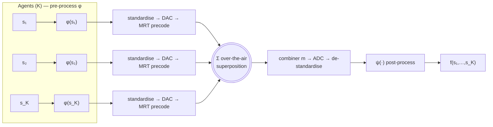

The per-operation diagrams below show only the `φ → Σ → ψ` essence (the shaded
stages above are identical for all of them).

### Natural-medium

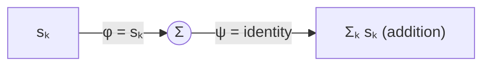

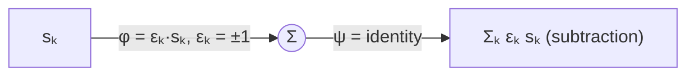

### Nomographic (pre-/post-processed)

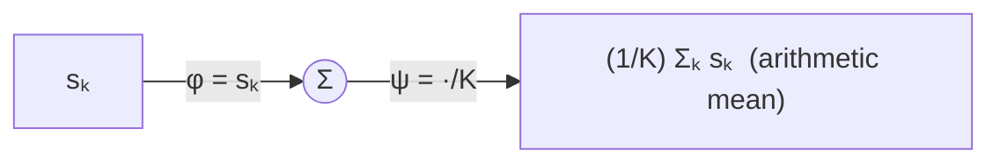

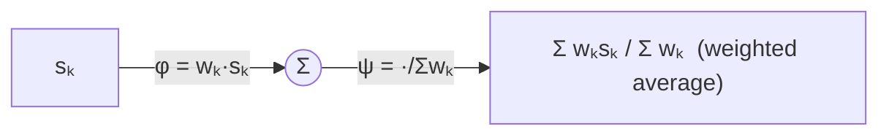

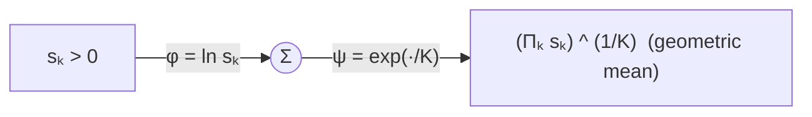

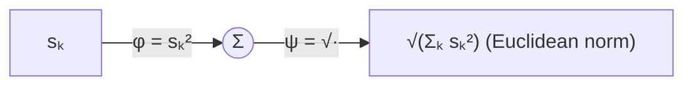

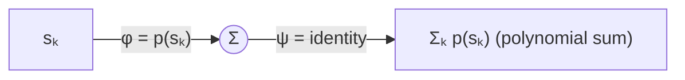

### Advanced / approximated

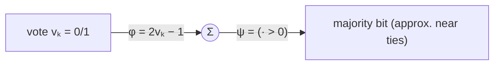

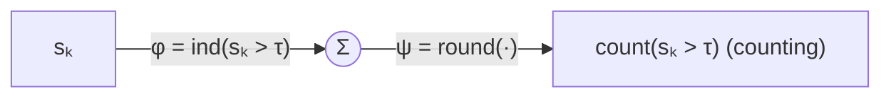

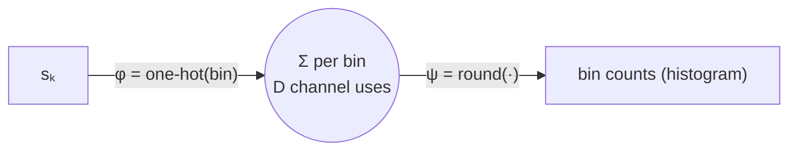

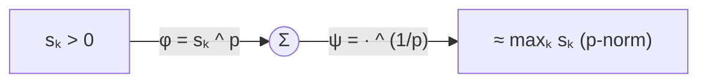

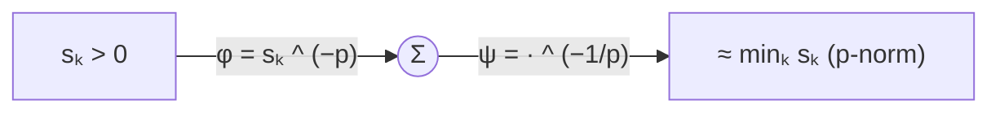

## Package layout

```
aircomp/
├── __init__.py       # public API
├── config.py         # RoomConfig, ChannelConfig, SystemConfig dataclasses
├── utils.py          # dB/linear + dBm/W conversions, RNG, array steering
├── nodes.py          # Agent and Host (ULA antenna geometry)
├── environment.py    # indoor room + random agent / ceiling host placement
├── channel.py        # indoor path-loss + Rician fading MIMO channel generator
├── functions.py      # operation library (natural-medium / nomographic / advanced)
├── aggregation.py    # AirComp receivers: beamforming + power control
├── metrics.py        # MSE / NMSE (linear and dB)
├── evaluation.py     # per-operation accuracy benchmarking
└── simulator.py      # Monte-Carlo orchestration + parameter sweeps
examples/
├── quickstart.py             # one scenario, one Monte-Carlo run
├── run_demo.py               # NMSE vs {tx power, #agents, #antennas}
└── evaluate_operations.py    # accuracy of every supported operation
```

## Installation

```bash
pip install -r requirements.txt
```

Only `numpy` is required for the core library; `matplotlib` is used by the
example plots.

## Quickstart

```python
from aircomp import Simulator, SystemConfig, OptimizedBeamformingAggregator, ArithmeticMean

config = SystemConfig(n_agents=50, n_hosts=1, host_antennas=8, agent_antennas=2,
                      tx_power_dbm=10.0, seed=0)
sim = Simulator(config,
                aggregator=OptimizedBeamformingAggregator(n_iter=200),
                function=ArithmeticMean())

result = sim.run_monte_carlo(n_trials=500)
print(f"Computation NMSE: {result.nmse_db:.2f} dB")
```

Parameter sweeps:

```python
import numpy as np
sim.sweep_tx_power(np.arange(-10, 31, 5))   # NMSE vs SNR
sim.sweep_n_agents([5, 10, 20, 40, 80, 160])
sim.sweep_host_antennas([1, 2, 4, 8, 16, 32])   # receive-beamforming gain
sim.sweep_agent_antennas([1, 2, 4, 8])           # transmit-beamforming gain
```

Run the full demo (writes PNGs into `examples/`):

```bash
python examples/run_demo.py
```

## Representative results

Scenario: 40 agents, 2 hosts × 8 antennas, 2.4 GHz indoor office.

* **vs transmit power** — MSE ∝ 1/P for both receivers; the optimised
  beamformer gives a steady ≈ 15 dB NMSE gain over MRC.
* **vs number of agents** — MRC degrades as the worst-agent bottleneck bites,
  while the optimised beamformer stays essentially flat, sustaining accuracy as
  the crowd grows.
* **vs host antennas** — the optimised beamformer's NMSE improves monotonically,
  reflecting the aggregation-diversity gain of more receive dimensions.

## Extending the framework

* **New operations** — subclass `Operation` (`functions.py`) and implement
  `pre`/`post` (plus `sample_data`/`true_value` to benchmark it); add it to the
  list passed to `evaluate_operations`.
* **New receivers** — subclass `Aggregator` (`aggregation.py`) and implement
  `design`; reuse `_channel_inversion` for the power-control step.
* **New channel effects** — extend `IndoorChannel.realize` (e.g. spatial
  correlation, blockage, mobility).
* **New topologies** — pass explicit `agents=`/`hosts=` lists to
  `IndoorEnvironment`, or override the placement methods.

## Background reading

The models follow the mainstream AirComp literature on analog function
computation over multiple-access channels, uniform-forcing / channel-inversion
transceiver design, and receive-beamforming (aggregation) MSE minimisation for
multi-antenna AirComp and federated edge learning.
